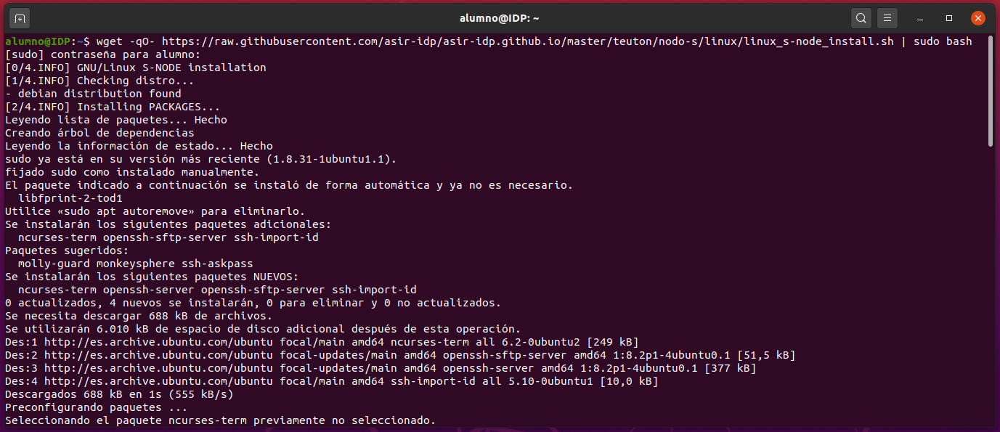
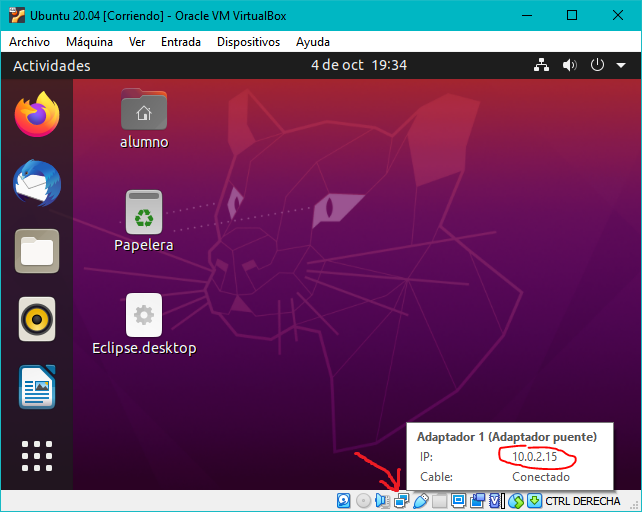

# Configurar una MV con GNU/Linux como Nodo-S

Para que el profesor pueda verificar la configuración de tu máquina virtual (MV) con GNU/Linux mediante **teuton** debes hacer lo siguiente:

## 1. Configurar la MV como Nodo-S

Abre un terminal (Ctrl + Alt + T):


Copia el siguiente comando, pégalo en el terminal y pulsa ENTER.

```bash
wget -qO- https://raw.githubusercontent.com/asir-idp/asir-idp.github.io/master/teuton/nodo-s/linux/linux_s-node_install.sh | sudo bash
```

Una vez ejecutado el comando, si todo va bien, el resultado debería ser similar al siguiente:



Mostrando al final algo como:

```bash
[4/4.INFO] Finish!
```

Esto indica que tu MV ya es un Nodo-S para **teuton**.

## 2. Hacer la máquina accesible al profesor

En este punto se dan dos posibles situaciones: si tu MV se encuentra a) **dentro del aula** o b) **en el exterior** (en tu casa, por ejemplo).

### a) Dentro del aula

Primero [configuramos la interfaz de red de la MV en **Adaptador puente**](../../virtualizacion/virtualbox/configurar-red-en-adaptador-puente) para que sea accesible desde la red del aula.

Luego averigua la dirección IP de tu MV de alguno de los siguientes modos:

- Abre un terminal y ejecuta el comando `ip a` o `ifconfig`.

- En la esquina inferior derecha de VBox se encuentra un icono que muestra la actividad de red de la MV, si mantenemos el puntero del ratón sobre dicho icono, nos mostrará la dirección IP:



Y finalmente, proporciona al profesor un fichero en formato YAML con el siguiente contenido, remplazando los valores indicados (`<address>` con la dirección IP de tu MV, y `<usuario>` y `<contraseña>` con las credenciales del usuario de la MV):

```yaml
- :tt_members: <tu nombre completo>
  :tt_moodle_id: <tu email de EVAGD>
  :host1_ip: <address>
  :host1_port: 22
  :host1_username: <usuario>
  :host1_password: <contraseña>  
  :tt_skip: false
```

Por ejemplo:

```yaml
- :tt_members: Francisco Vargas Ruiz
  :tt_moodle_id: mi@email.es
  :host1_ip: 10.0.2.15
  :host1_port: 22
  :host1_username: alumno
  :host1_password: onmula
  :tt_skip: false
```

> Siendo `alumno` el nombre del usuario de la MV y `onmula` su contraseña.

**El profesor te indicará el medio a través del  cuál deberás entregar este fichero.**

### b) En el exterior

Primero, debes [darte de alta](https://dashboard.ngrok.com/signup) en la web de `ngrok` y obtener así tu `<auth_token>`.


Luego, desde un terminal, autoriza esta máquina para usar `ngrok`:

```bash
ngrok authtoken <auth_token>
```


A continuación, también desde un terminal, ejecuta el siguiente comando:

```bash
ngrok tcp 22 -region eu
```


Y finalmente, proporciona al profesor un fichero en formato YAML con el siguiente contenido, indicando tus datos y remplazando los señalados en la imagen (`<address>` y  `<port>` con los datos que devuelve **ngrok**; y `<usuario>` y `<contraseña>` con las credenciales del usuario de la MV):

```yaml
- :tt_members: <tu nombre completo>
  :tt_moodle_id: <tu email de EVAGD>
  :host1_ip: <address>
  :host1_port: <port>
  :host1_username: <usuario>
  :host1_password: <contraseña>
  :tt_skip: false
```

Por ejemplo:

```yaml
- :tt_members: Francisco Vargas Ruiz
  :tt_moodle_id: mi@email.es
  :host1_ip: 0.tcp.eu.ngrok.io
  :host1_port: 12375
  :host1_username: alumno
  :host1_password: onmula
  :tt_skip: false
```

> Siendo `alumno` el nombre del usuario de la MV y `onmula` su contraseña.

**El profesor te indicará el medio a través del cuál deberás entregar este fichero.**