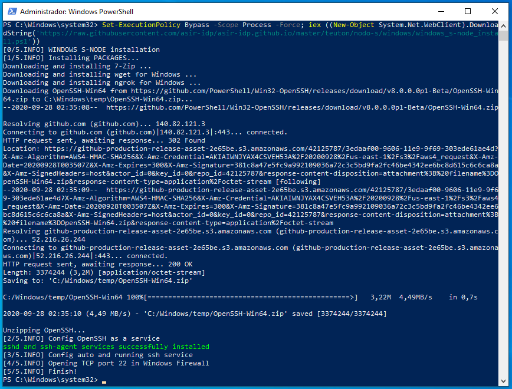

# Configurar una MV con Windows como Nodo-S

Para que el profesor en el aula pueda verificar la configuración de tu máquina virtual mediante la herramienta **teuton** debes:

## 1. Configurar la MV como Nodo-S

Abrimos **PowerShell** como `Administrador`.


Copia el siguiente comando, pégalo en el terminal anterior y pulsa ENTER.

```powershell
Set-ExecutionPolicy Bypass -Scope Process -Force; iex ((New-Object System.Net.WebClient).DownloadString('https://raw.githubusercontent.com/teuton-software/teuton/master/install/windows/windows_s-node_install.ps1'))
```

Una vez ejecutado el comando, si todo va bien, el resultado debería ser similar al siguiente:



Finalizado este apartado, esta máquina virtual ya sería un Nodo-S de Teuton.

### 2. Configurar la interfaz de red en Adaptador puente

Configuramos la interfaz de red de la máquina virtual en este modo para que ésta esté accesible desde la red del aula. Sigue las instrucciones de este [enlace](../../instalacion/configurar-adaptador-puente-vbox) para configurarlo.

### 3. Hacer la máquina accesible al profesor

En este punto se dan dos situaciones: si la máquina del alumno se encuentra a) **dentro del centro** o b) **en el exterior** (en su casa, por ejemplo).

#### a) Me encuentro dentro del centro

En este caso debemos establecer la siguiente configuración de red en la máquina virtual:

| Parámetro de red | Valor        |
| ---------------- | ------------ |
| Dirección IP (*ip address*) | 10.1.**x**.**y** |
| Máscara de red (*netmask*) | 255.255.0.0  |
| Puerta de enlace (*gateway*) | 10.1.0.1     |
| DNS              | 8.8.8.8 |

> Siendo:
>
> -  **x** el número asignado por el profesor a cada alumno
> -  **y** un número del 1 al 254

Cómo establecer la configuración de red en ...

* [Windows 10](https://pureinfotech.com/set-static-ip-address-windows-10/#static_ip_controlpanel_windows10)

#### b) Me encuentro fuera del centro (en mi casa, ...)

1. Configurar **ngrok** como se explica en el siguiente en [enlace]().
2. Ejecutar el siguiente comando desde PowerShell o CMD:

```bash
ngrok tcp 22 -region eu
```
